# Definitions

* **A Disk Graph** - An intersection graph of disks in $\mathbb{R}^2$ .
* **An intersection graph** is a general recipe for turning a collection of geometric objects into a graph:
	- Take any family of objects — disks, line segments, rectangles, intervals on a line, whatever.
	- Make one **vertex** per object.
	- Draw an **edge** between two vertices exactly when their objects overlap (have at least one point in common).
* **Representation of a Disk** - usually given as $D(a, r)$ where $a \in \mathbb{R}^2$ is the center point of the disk  and $r \in \mathbb{R}$ is the disk's radius.
* **$|ab|$** is the **Euclidean distance** between points $a$ and $b$ (same as $||a-b||$ or $d(a,b)$)
* **An independent set** in graph theory is a set of vertices where no two vertices are connected by an edge.
* A **co-bipartite graph** is a graph whose complement is a bipartite graph.
* **A bipartite graph** is a network of dots (vertices) and lines (edges) where you can split all the dots into two separate groups so that no two connected dots belong to the same group.
## Notes

Things worth internalizing for this paper on intersection graphs:

1. **The graph forgets the geometry.** Two very different disk arrangements can produce the same abstract graph. That's why the paper assumes the disk _representation_ (centers and radii) is given as input — recovering disks from an abstract graph is itself a hard problem (because its a complex constraints satisfaction problem).
2. **Adjacency = distance condition.** Disks D(a, r₁) and D(b, r₂) intersect exactly when |ab| ≤ r₁ + r₂. This little equivalence is used constantly in the proofs: every claim "these disks are adjacent" is really the claim "their centers are close enough." For unit disks (all radii 1), adjacent simply means centers within distance 2.
	1. Ergo - "Two disks intersect exactly when the distance between their centers is at most the sum of their radii." 
3. How can we take the MAX CLIQUE problem which is NP-hard in the general case, and solve it in polynomial time for disk graphs? we leverage the geometic nature of the graph to find a SOUND and COMPLETE method to filter out most of this graph into candidate solutions and take the max solution. SOUND = every candidate is a valid clique, COMPLETE = the method guarantees that we will eventually test the optimal candidate.

Computing a maximum clique in a **unit** disk graph (all radii are 1) was shown in polynomial time a long time ago.


## The main results
1. An algorithm for finding the maximum clique of the disk graph is found which is $O(n^{2k}poly(n))$ time complexity where $k$ is the distinct number of disk radii in the graph and $n$ are the number of disks. - Which means that for any *fixed* $k$ this is polynomial, and specifically $k=2$ which was *the* open problem.
2. An $O(n^{4/3})$ speedup factor of improvement was made to the problem of eagerly computing all rectangle range queries which find maximum cliques in a given unit disk graph of $n$ disks. Ergo - the authors precompute max cliques for all O(n⁴) canonical rectangles in O(n⁵ log n) total time, which is at least a factor n^{4/3} faster than solving each rectangle independently."
3. In contrast to the known NP-hardness result of Finding a maximum clique in an arbitrary ball graph - if we assume $k$ distinct radii of the balls and that their centers lie on $r$ parallel planes then an $O(n^{2rk}poly(n,r))$ time algorithm for computing their max clique was found by the authors.

## Why is the maximum clique problem is famous (even for k=2)?

#### Motivation for studying disk graphs
Disk graphs are useful in modelling applied contexts (e.g wireless networks) so being able to solve a maximum clique for any fixed k>1 in polynomial time is very valuable towards being able to model realistic scenarios rather than having to assume all disks are of the same radius, which forces a "degenerate" model of the problem.

#### Why it actually became famous

- **Its unresolved complexity status.** For 35+ years, nobody could prove the problem NP-hard _or_ find a polynomial algorithm. That limbo is rare and precious: most natural problems eventually fall on one side. Compare the neighbors listed in the intro — max clique is **NP-hard for rays, ellipses, triangles, grounded strings and _ball_ graphs**, yet **polynomial for unit disks, rectangles, trapezoids**. *Disk graphs* sit exactly on the **unmapped** boundary between the two worlds.
- **The contrast with the 1990 unit-disk result.** Clark–Colbourn–Johnson solved the unit-radius case cleanly in 1990. Going from "all radii equal" to "even just _two_ radii allowed" broke every known technique — which is what made Cabello pose the k = 2 case explicitly as an open question in 2015. When a tiny generalization resists 35 years of attempts, that's fame.
- **Community attention.** The intro documents this deliberately: quoted as "an intriguing open question," "a notorious open question in computational geometry," "elusive with no new positive or negative results," a "long-standing open problem" — plus the fact that the best-known approximation (factor 2, via stabbing disks with four points) couldn't even be improved to 1.99.

## "The Deception of the Lens" - why the lens-based approach fails for two radii

### Clark–Colbourn–Johnson algorithm for max clique in UDGs

The idea here is that the intersection of disks forms a lens region such that disks whose centers are located inside the lens region, form a co-bipartite graph in the Unit Disk Graph (UDG) in which we can be find a maximum clique in polynomial time. We then simply brute-force (aka "guess") through all combinations of the two len-forming disks and report the max clique found. 

#### Why is the lens region co-bipartite?

Because if we divide it in half by line $uv$  we get 2 lens halves which are convex shapes. The extreme points of these lens halves are always distanced $d$ from each other which implies that any two points (possible disk centers) are distanced at mximum $d$ from each other which means they intersect.

**Important** - Disks from the top and bottom halves also may intersect each other! this is why it is hard to directly find the maximum clique in the subgraph of the UDG induced by the lens (it may be composed of disks from both sides!). Instead the complemantary graph is used and a max-independent-set algorithm yields exactly the max clique in the original subgraph.

**Important** - The lens we are examining here is the one formed by the two circles of radius $d$ around $u$ and $v$ it is NOT the intersection of the 2 unit disks centered at $u$ and $v$ - this is the confusing part.

**Important** - We dont really have to construct a lens in the algorithm and do all of the parititioning - simply filtering the vertices by distance to u and v suffices - the resulting subgraph is the co-bipartite one on which we compute the 2 final steps (inversion and bipartite matching). 
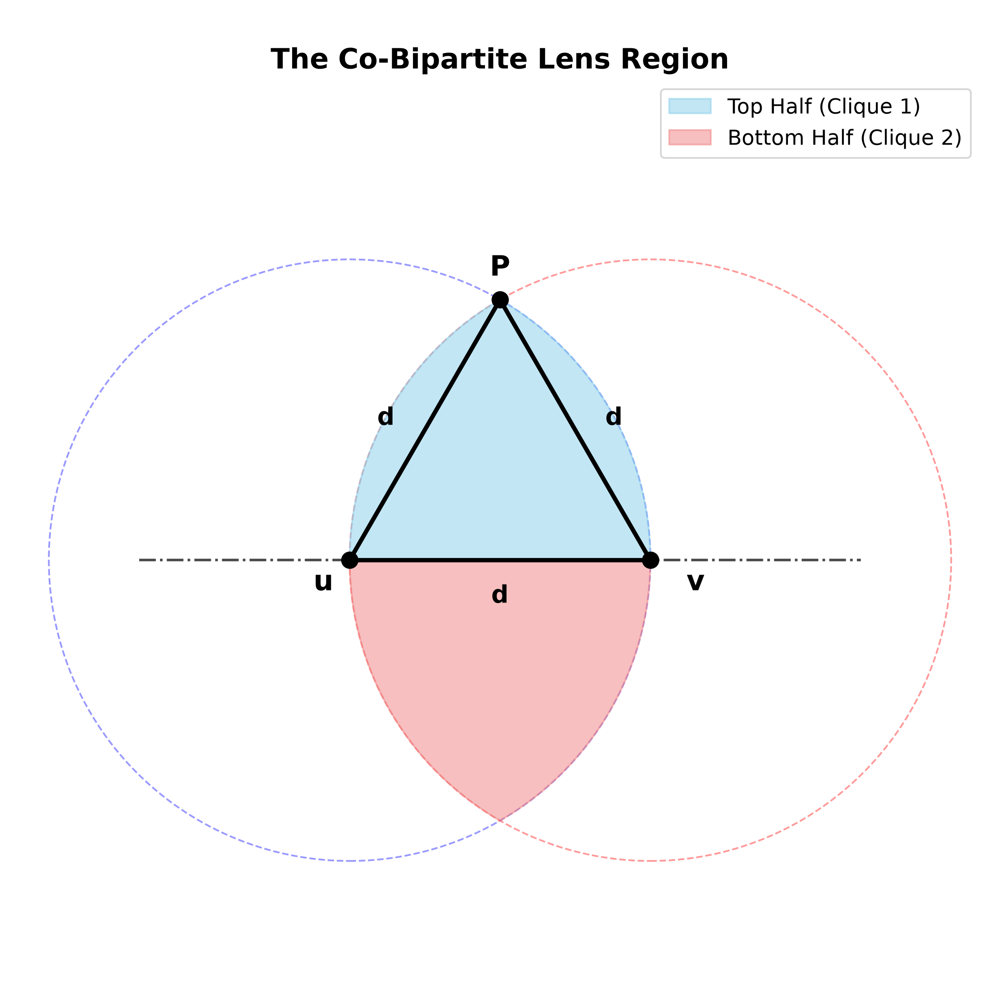

#### Pseudo-code

```
function FindMaxCliqueUDG(Vertices, edge_threshold):
    max_clique_size = 0
    best_clique = []

    // Edge case: empty graph
    if Vertices is empty:
        return best_clique

    // Step 1: Guess the diameter pair
    for u in Vertices:
        for v in Vertices:
            d = distance(u, v)
            
            // If u and v are further apart than the graph's threshold, 
            // they do not share an edge. Skip this pair.
            if d > edge_threshold:
                continue
            
            SetA = []
            SetB = []
            
            // Step 2: Isolate the lens and partition (The Cross-Product trick)
            for w in Vertices:
                // w must be inside the lens (within distance d of both u and v)
                if distance(w, u) <= d and distance(w, v) <= d:
                    
                    // Determine which side of the uv line vertex w falls on
                    cross_product = (v.x - u.x)*(w.y - u.y) - (v.y - u.y)*(w.x - u.x)
                    
                    if cross_product >= 0:
                        SetA.append(w)
                    else:
                        SetB.append(w)
            
            // Step 3: Build the Bipartite Complement Graph
            // An edge exists here ONLY if it is missing in the original UDG
            ComplementEdges = []
            for a in SetA:
                for b in SetB:
                    // If they don't intersect in the UDG, add an edge in the complement
                    if distance(a, b) > edge_threshold: 
                        ComplementEdges.append((a, b))
            
            // Step 4: Solve via Bipartite Matching (Kőnig's Theorem)
            // Find the maximum bipartite matching (e.g., using Hopcroft-Karp)
            matching_edges = HopcroftKarp(SetA, SetB, ComplementEdges)
            
            // The size of the Maximum Independent Set is the total number 
            // of vertices minus the size of the maximum matching
            current_clique_size = (length(SetA) + length(SetB)) - length(matching_edges)
            
            // Step 5: Update global maximum
            if current_clique_size > max_clique_size:
                max_clique_size = current_clique_size
                // Extract the actual vertices of the independent set from the matching
                best_clique = ExtractIndependentSet(SetA, SetB, matching_edges)
                
    return best_clique
```
#### Why is this even working for UDGs?

1. Because geometrically, every max clique has a "diameter" - it is finite so there are 2 disks $u^*, v^*$  such that $d^* = d(u^*,v^*)$ and the distance between any other pair of disks is less than or equal to $d^*$.
2. The Inescapable Lens Containment - because of the existence of $d^*$ there can be no other vertex in the clique that will be further apart than length $d^*$ from  either $u^*, v^*$.
3. The exhaustive loop - we consider all pairs therefore we will stumble upon $u^*, v^*$.
4. The optimal len is co-bipartite - therefore - the bipartite matching algorithm on the complement graph is mathematically guaranteed to find the _exact_ Maximum Independent Set (which is equivalent to the maximum clique in the UDG).

##### The CCJ recipe visualized
Guess the farthest pair $(v, w)$; every center adjacent to both must lie in the lens of radius $|vw|$. The line $\ell_{vw}$ splits that lens into two halves, and each half is a clique — so only the *cross-half* pairs are ever in doubt, and those are exactly what the bipartite matching resolves.
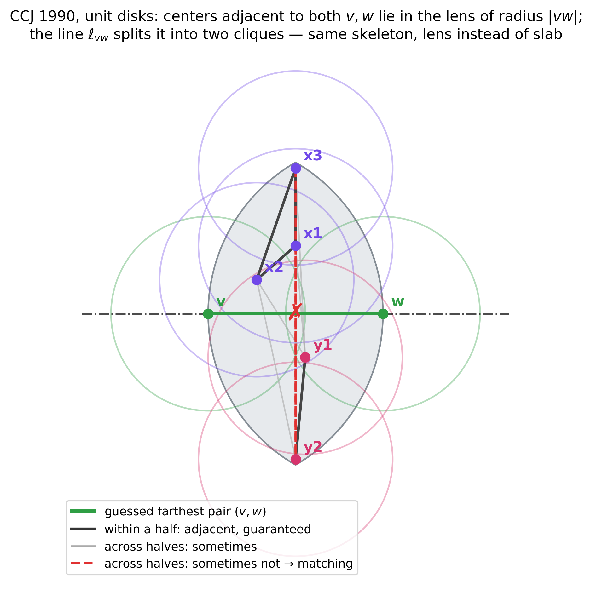

##### The deception

The deceptive assumption was that CCJ's diameter-pair-plus-lens recipe generalizes to mixed radii — but the lens split no longer forces the two mutually-adjacent camps needed for a co-bipartite complement, and no amount of additional guessing visibly repairs it. The paper escapes by changing the guess itself: extreme-left and extreme-right disks per radius type, with slabs replacing lenses.

Same recipe, two radii: guessing the farthest *small* pair $(p, q)$ confines small centers to the small lens $L_s$ and big centers to the larger lens $L_b$. But $u_1$ and $u_2$ can sit on the **same** side of $\ell_{pq}$ while $|u_1u_2| > 2r_b$ — same camp, yet not adjacent. The split stops forcing cliques, so the complement stops being bipartite and König no longer applies.
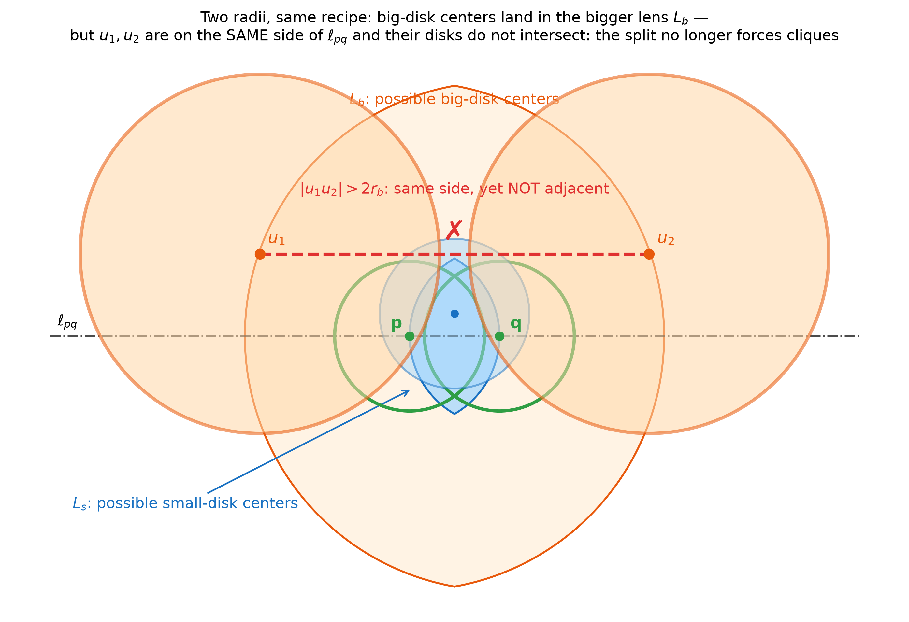

## Phase 3 — Lemma 2.1 (the foundation)

#### Visualization of Upper and Lower slabs
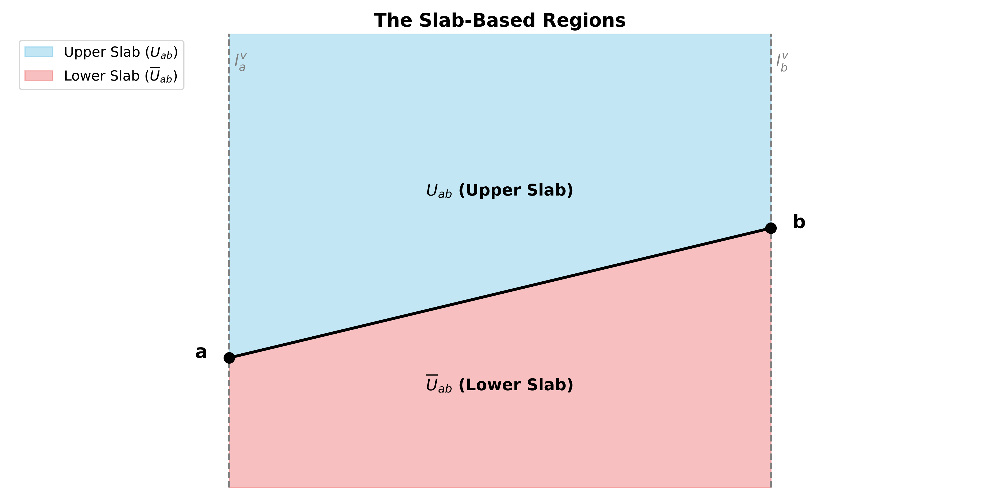

### Lemma 2.1
Let $ab$ be a line segment and let $U_{ab}$ be the upper slab of ab.
Let $q = (x_q, y_q)$ be a point in $U_{ab}$.
Let $p = (x_p, y_p)$ such that $y_p \geq y_q$.
Then $|pq| \leq max\{|pa|, |pb|\}$.

Distinguish 2 scenarios:
1. $ab$ is not vertical ($x$ coords of $a$ and $b$ are different)
	1. $o$ is on $ab$
	2. $o$ is on $U_{ab}$'s wall
2. $ab$ is vertical

#### Scenario 1:
* The ray that starts at $p$ and passes through $q$ must intersect the boundary of  $U_{ab}$ at point $o$ ** because $y_p \geq y_q$**.
* It intersects either $ab$ or the sides of the slab.
* $m$ is a point such that $pm$ is perpendicular to the line on which the ray hits the boundary of $U_{ab}$.
* "Silding" $o$ away from $m$, in either direction, increases the length of $po$ monotonically up to $max\{|pa|, |pb|\}$. 
* And we get: $|pq| \leq |po| \leq max\{|pa|, |pb|\}$
#### Scenario 1 Visualized:
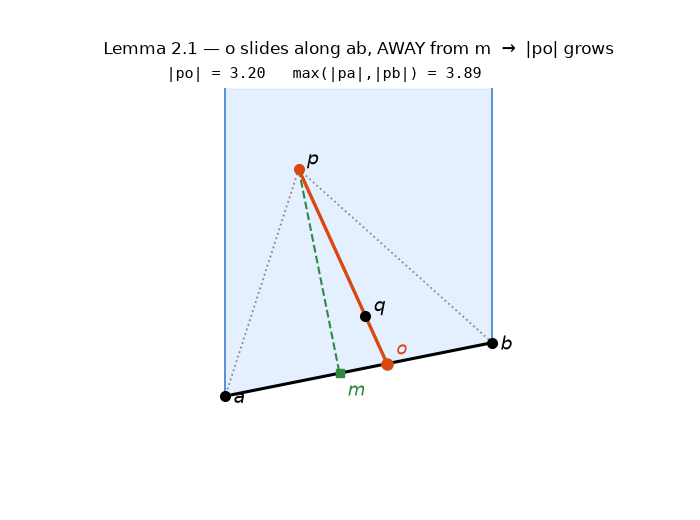


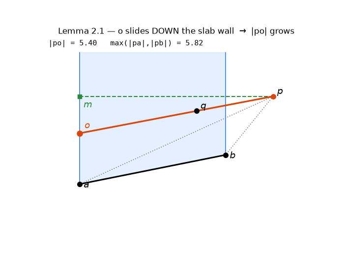


#### Scenario 2:
* $x$ coords of $a, b$ are the same ($ab$ is a vertical segment and $U_{ab}$ is a ray)
* If $y_a < y_b$ then $|pq| \leq |pa|$
* Else $y_b < y_a$ then $|pq| \leq |pb|$
#### Scenario 2 Visualized:
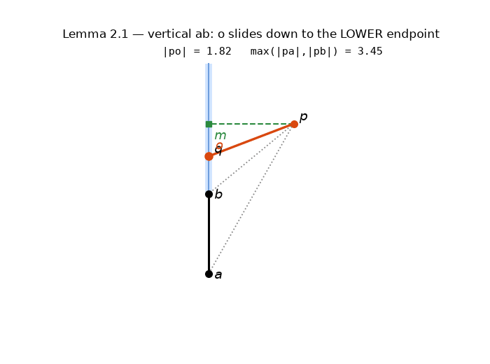
## Phase 4 -  The Main Algorithm (Section 3)

#### Notation
* $\mathcal{D}_k$ a disk graph where the number of different types of radii is at most $k$
* The radii of $\mathcal{D_k}$ are denoted: $r_1,..,r_k: \forall_{1\leq i < j \leq k}: r_i<r_j$
* *type-i disk* is a disk of radius $r_i$
* $C_i$ is a clique that contains only disks of type $i$
* $\mathcal{C}$  is a maximum clique of $\mathcal{D}_k$ 
* $\mathcal{C_i} \subseteq \mathcal{C}$  is a maximal clique in $\mathcal{C}$ where all disks are of type $i$ (**NOT** a maximum clique in $\mathcal{D}_k$ of type $i$ disks).

#### Notation Visualizations
##### Disk Graph

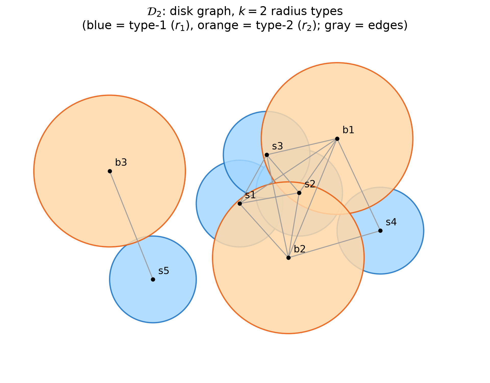
#####  Single type clique

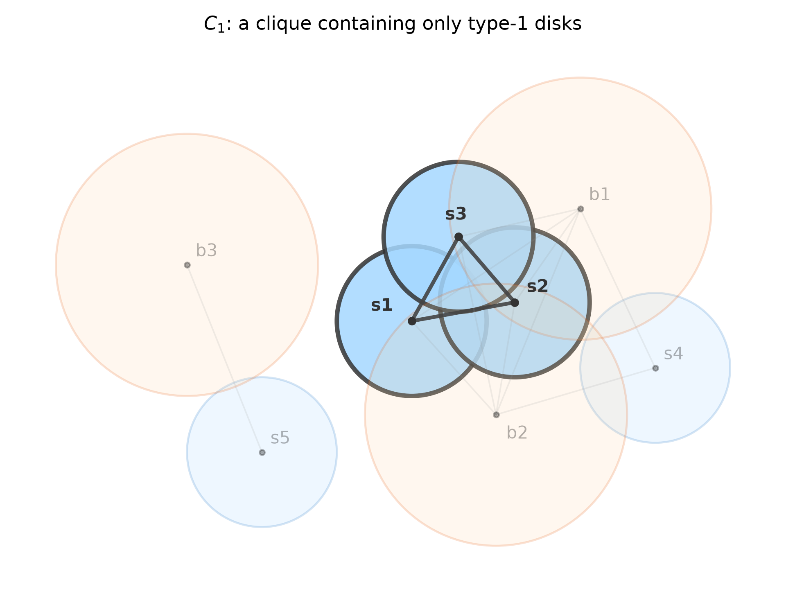

##### Maximum clique
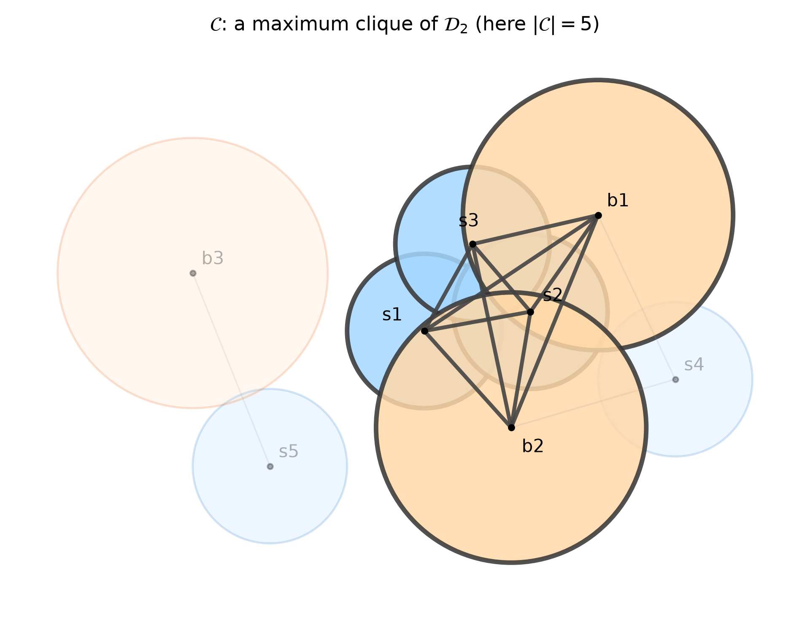

##### Maximum same-type cliques
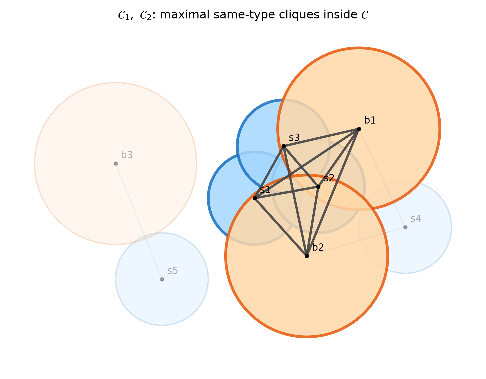

#### A note about "guessing"

Guessing = exhaustive enumeration over all candidates. Wrong guesses are harmless because the construction guarantees every candidate output is a true clique (soundness, via Lemma 3.1 — which never assumes the guess is right), while the one correct guess guarantees the maximum is reached (completeness). The only validation needed is that the guessed set $\Psi$ itself is pairwise intersecting.

##### Why not just sort and take the extremes?
The tempting shortcut is to sort the type-$i$ disks by $x$ and take the two extremes — no enumeration needed. It fails, and it fails instructively: the sorted extremes of *all* type-1 disks ($s_5$ leftmost, $s_4$ rightmost) are not even members of $\mathcal{C}$. The pair the analysis needs are the extremes **of $\mathcal{C}_1$** — a set defined by the very answer being computed. Knowing them in advance is knowing the solution, so no sorting shortcut can exist, and the $O(n^{2k})$ enumeration is not laziness but the price of that circularity.
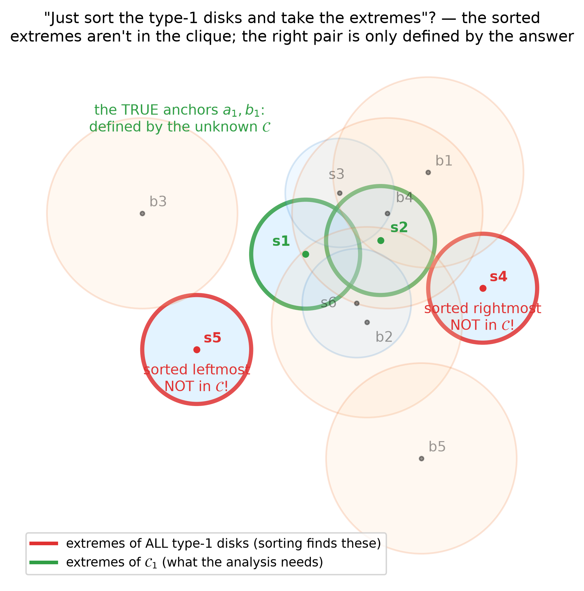

#### The algorithm in a nutshell
* We guess the subset of radii types that appear in $\mathcal{C}$ (e.g $r_1, r_5, r_{k-1}$) - total $2^k$ possibilities (power-set of a set of $k$ elements)
* Compute candidate solutions and - 
* Take the maximum over all the solutions computed from these $2^k$ guesses
#### Intuition
_each guess uses slabs + anchor-filtering to carve a candidate set that is automatically two cliques (upper camp, lower camp); the correct guess traps all of $\mathcal{C}$ inside its candidate set; bipartite matching then extracts the best mutually-compatible selection across the two camps; the outer max over guesses delivers $|\mathcal{C}|$._ Note the pleasing symmetry with CCJ: their lens split by segment $pq$ gave two camps for equal radii; the slabs restore precisely that two-camp guarantee when radii mix — same skeleton, better split.
#### How a solution is computed given a radii-set 
* Note: We consider the worst case for complexity analysis - the radii set contains all $k$ radii types
* For each disk type $i$ we guess two disk centers $a_i,b_i$ from $\mathcal{C}_i$ where $a_i$ is the leftmost and $b_i$ is rightmost.
	* We denote the set of all these disk centers $\Psi$
	* $\Psi$ has $2k$ elements in the worst case
>* For all $i \leq k$ define $X_i$ as the set of disks whose **center is in $U_{a_ib_i}$** ==***AND***== **intersect all the disks in $\Psi$**..
>* Similarily define $Y_i$ as the set of disks whose **center is in $\overline{U}_{a_ib_i}$** ==***AND***== **intersect all the disks in $\Psi$**.
>* The unions $X = \cup_{i=1}^k X_i$ and $Y = \cup_{i=1}^k Y_i$ are cliques in $\mathcal{D}_k$. - **This is the key! Lemma 3.1 gives us this**.
* Therefore the subgraph of $\mathcal{D}_k$ composed of $X \cup Y$ is co-bipartite (**any 2 cliques in a graph form a co-bipartite graph** - a true statement that I wont prove)
* Therefore its complement, denoted $H$ is Bipartite.
* Because $\Psi \subseteq \mathcal{C}$ it follows that $\mathcal{C} \subseteq (\Psi \cup X \cup Y)$
* From the last to statements it follows that we can compute $\mathcal{C}$ from a maximum bipartite matching in $H\ \blacksquare$.
##### Explanations and clarifications
* **$\mathcal{C} ⊆ \Psi \cup X \cup Y$ for the correct guess:** follows from the _definitions_ of leftmost/rightmost (centers of $\mathcal{C}$'s disks lie in the slabs) and of a clique ($\mathcal{C}$'s disks intersect all of $\Psi \subseteq \mathcal{C}$). No geometry needed.
* **Why Ψ can be excluded from the hard computation.** Every disk in X ∪ Y intersects _all_ of Ψ — that's the filter that defined X and Y in the first place. And Ψ itself is pairwise intersecting (for the correct guess because Ψ ⊆ C; for other guesses because we discard the ones that fail the check). So Ψ's disks are adjacent to each other _and_ to every candidate. Consequence: K is a clique in the graph on X ∪ Y **if and only if** K ∪ Ψ is a clique in the whole candidate set. Ψ imposes no constraint on the choice within X ∪ Y — it's universally compatible, so you can solve the interesting problem on X ∪ Y alone and append Ψ to whatever comes out.
* **The accounting for the correct guess.** $\mathcal{C} ⊆ \Psi \cup X \cup Y$, and  $\Psi \subseteq \mathcal{C}$. So $\mathcal{C} \setminus \Psi$ is a clique living inside $X \cup Y$, meaning the max clique of the graph on $X \cup Y$ has $size ≥ |\mathcal{C}| − |\Psi|$. The algorithm outputs $\Psi \cup (\text{max clique of} X \cup Y)$ , which therefore has $size \geq |\mathcal{C}|$ — and by soundness it can't exceed $|\mathcal{C}|$. Equality.
* Max clique in the candidate graph on X ∪ Y = max **independent set** in its complement H; H is bipartite (sides = X's complement-vertices and Y's complement-vertices, since X and Y are cliques, all complement-edges run between the camps... plus possibly _within_? No — X a clique means no complement-edges inside X; same for Y — that's precisely bipartiteness of H); and in bipartite graphs, max independent set = n − max matching by König. That three-hop chain — clique → complement independent set → König → matching — is the part audiences ask to see slowly, so rehearse saying it in one breath.
* Xᵢ takes **type-i disks only** with centers in U_{aᵢbᵢ}. The paper's sentence ("every disk that has its center in U_{aᵢbᵢ}…") reads ambiguously, but Lemma 3.1's proof settles it — the i = j case uses "p and q correspond to type-i disks" to get the 2rᵢ bound, which requires Xᵢ's members to have radius rᵢ. A type-j disk whose center happens to fall in type-i's slab isn't lost, of course: if it's in C, it lies in its _own_ type's slab (that's what leftmost/rightmost of type j means), which is all that completeness needs. Good defensive detail to have ready if someone asks "wait, which disks go in which Xᵢ?"
* **"leftmost and rightmost" is a sentence from the analysis, not from the algorithm.** The algorithm never identifies extremes of anything — it just enumerates all O(n²) pairs per type. The analysis then says: among these iterations there exists one where the pair _happens to equal_ the extremes of the true 𝒞ᵢ, and that iteration's output is certified ≥ |𝒞|. The enumeration is how you purchase unknowable information with running time — n^{2k} is literally the price tag on "I cannot know 𝒞's anchors in advance." (Same purchase CCJ made in 1990: the farthest pair of the clique is equally unknowable, hence their O(n²) outer loop over all pairs.)


> [!NOTE] The entire mathematical content is Lemma 3.1
> **"It now *suffices* to show that the disks in X (similarly, the disks in Y ) are mutually adjacent."**
>
> Why "*suffices*" is the right word — it's worth tracing what's genuinely left once $X$ and $Y$ are cliques, because everything else in the argument is either definitional or classical:
>
>- $\mathcal{C} ⊆ \Psi \cup X \cup Y$ for the correct guess: follows from the _definitions_ of leftmost/rightmost (centers of $\mathcal{C}$'s disks lie in the slabs) and of a clique ($\mathcal{C}$'s disks intersect all of $\Psi \subseteq \mathcal{C}$). No geometry needed.
>
>- Complement of the graph on $X \cup Y$ is bipartite: immediate _given_ $X, Y$ are cliques — no complement-edges inside either camp.
>
>- Max clique from matching: König, textbook.


So the entire original mathematical content of Section 3 is concentrated in one place: Lemma 3.1 (which itself is bookkeeping on top of Lemma 2.1). Everything else is assembly. That's a great framing sentence for your talk, by the way: "the paper's whole new idea fits in one lemma about slabs; the rest is 1990s-vintage machinery" — it makes the "Made Easy" title land.

Two small reading notes on the lemma statement itself, so the quantifiers don't trip you:

1. Lemma 3.1 says "the disks in Xᵢ ∪ X_j are mutually adjacent for every i, j." Since i = j is allowed, this covers within-type adjacency too, and since any two disks of X lie in _some_ Xᵢ and X_j, the lemma really does prove all of X is one clique — pairwise statements suffice.
2. The paper proves only the X side and says "similarly Y." For your presentation, be ready to state why that's legitimate: the lower-slab case is the mirror image — reflect the plane across a horizontal line and upper slabs become lower slabs, Lemma 2.1 flips accordingly (the point p now has y-coordinate ≤ q's). Nothing new happens, but a picky audience member might ask you to say so out loud.

### Algorithm Visualizations

Storyboard order for the deck — one full iteration of the algorithm, rendered on the
extended 11-disk arrangement.

#### S5 — The guess
One guess out of $O(n^{2k})$: the leftmost and rightmost anchors $(a_i, b_i)$ of each type, which together form $\Psi$.
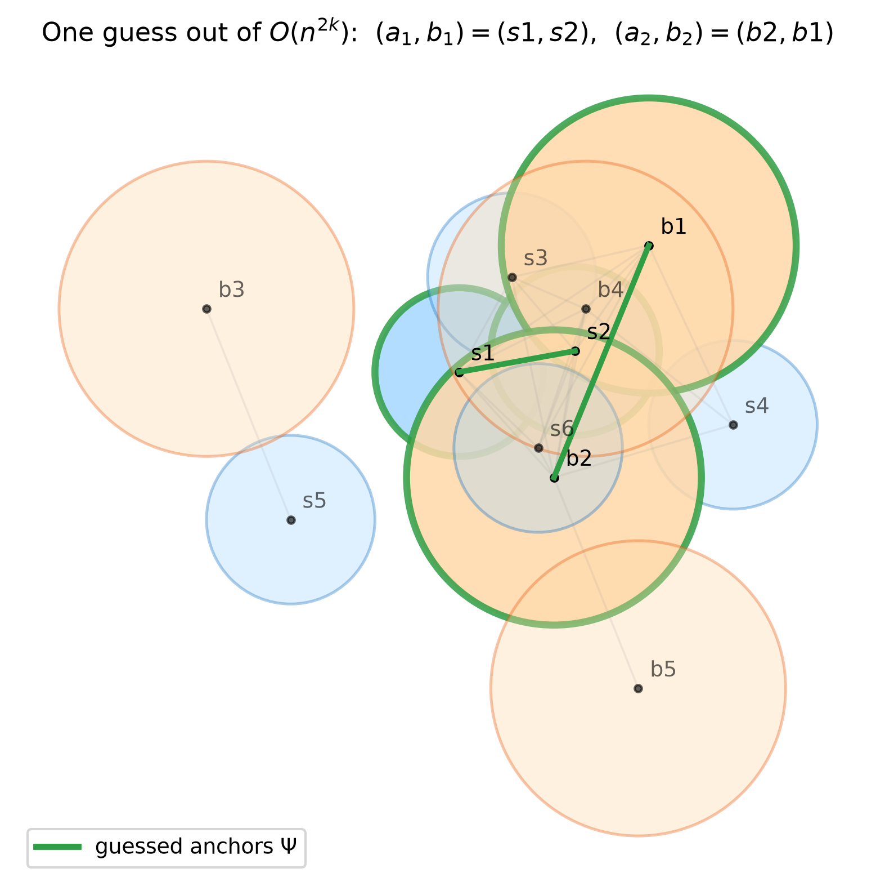

##### Aside — a worthless guess
The two guessed anchors don't intersect, so $\Psi$ is not pairwise intersecting and the iteration is discarded before any real work happens. Harmless: soundness never assumed the guess was right.
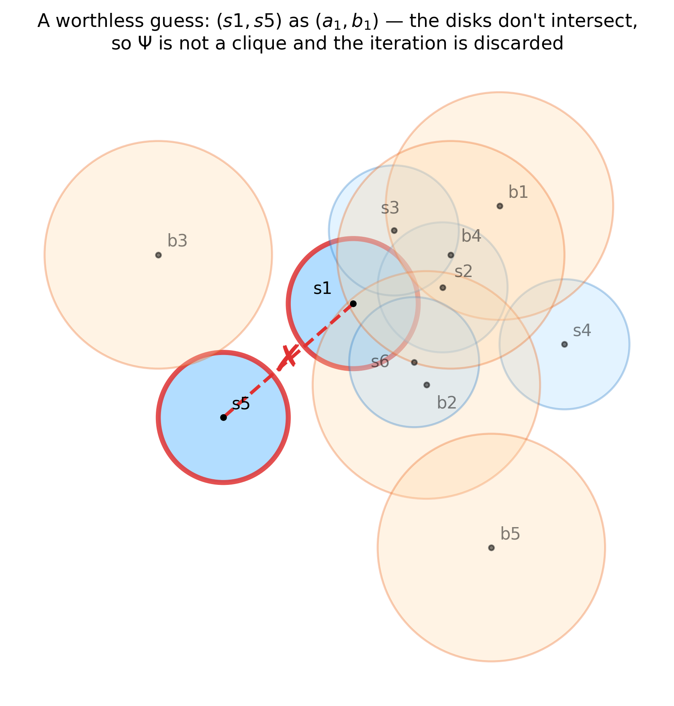

#### S6 — The slabs
$U_{a_ib_i}$ (solid) and $\overline{U}_{a_ib_i}$ (hatched), one pair per radius type.
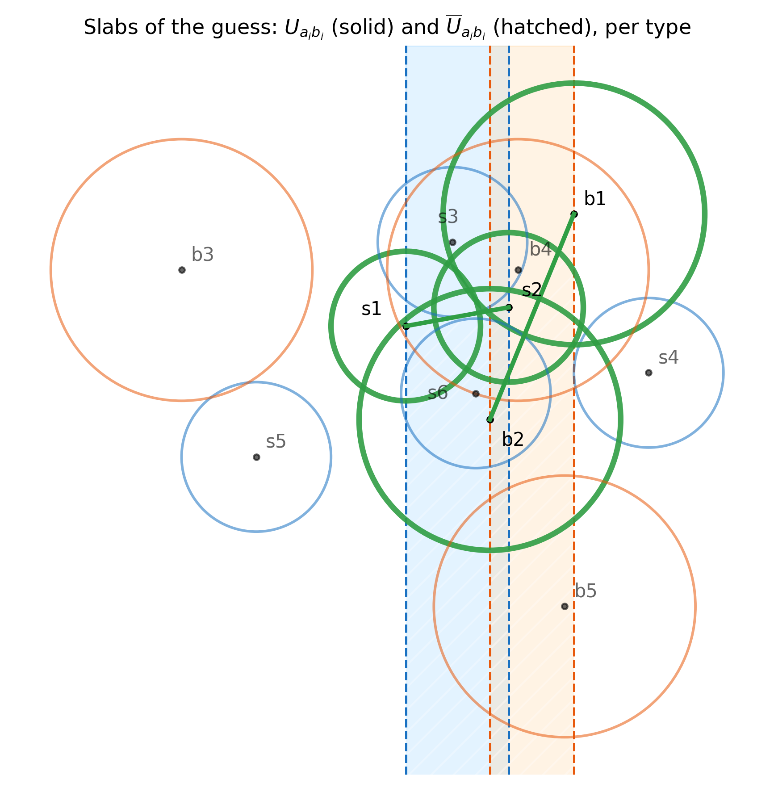

#### S7 — The filter
Keep a disk iff its center lies in its own type's slab **and** it intersects every disk of $\Psi$. The survivors are $X$ (upper camp) and $Y$ (lower camp).
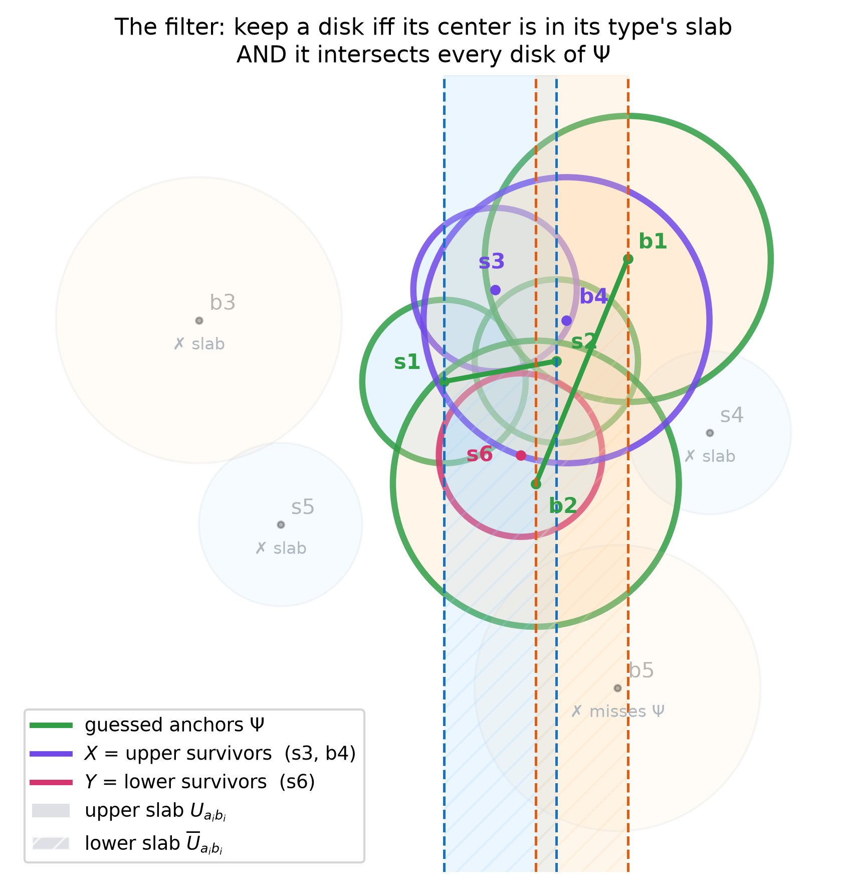

#### S8 — Lemma 3.1 payoff: $X$ is a clique
The upper camp $X$, together with $\Psi$, is mutually adjacent. This is the one place the paper does genuinely new mathematical work — everything after it is assembly.
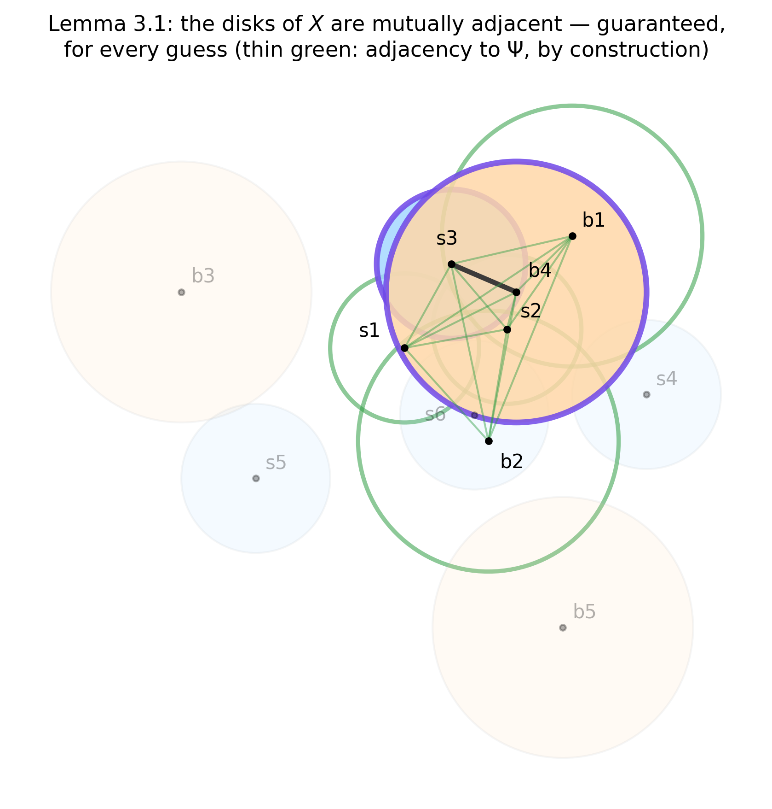

#### S9 — But $X \cup Y$ is not a clique
The missing pairs cross the camps. This is precisely why a matching step is needed instead of just returning $X \cup Y$.
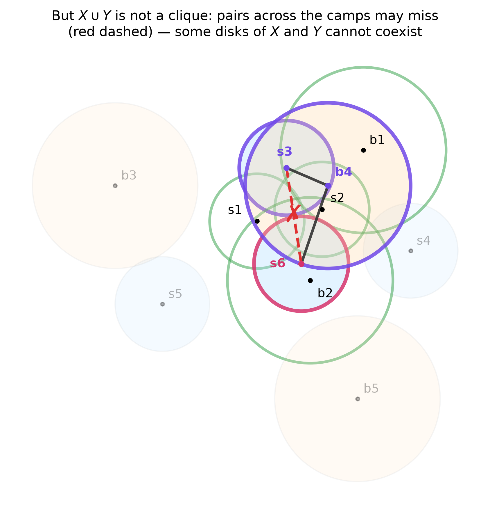

#### S10 — The complement $H$, and König
The candidate graph on $X \cup Y$ beside its complement $H$. Since $X$ and $Y$ are each cliques, no complement-edge lives inside a camp, so $H$ is bipartite and $\alpha(H) = |X \cup Y| - \text{max matching}$.
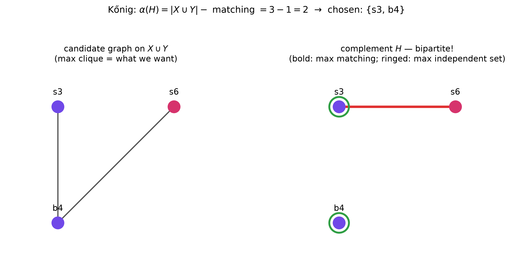

#### S11 — Assembly
$\Psi \cup (\text{selected disks})$ is this iteration's output. The outer maximum over all guesses delivers $|\mathcal{C}|$.
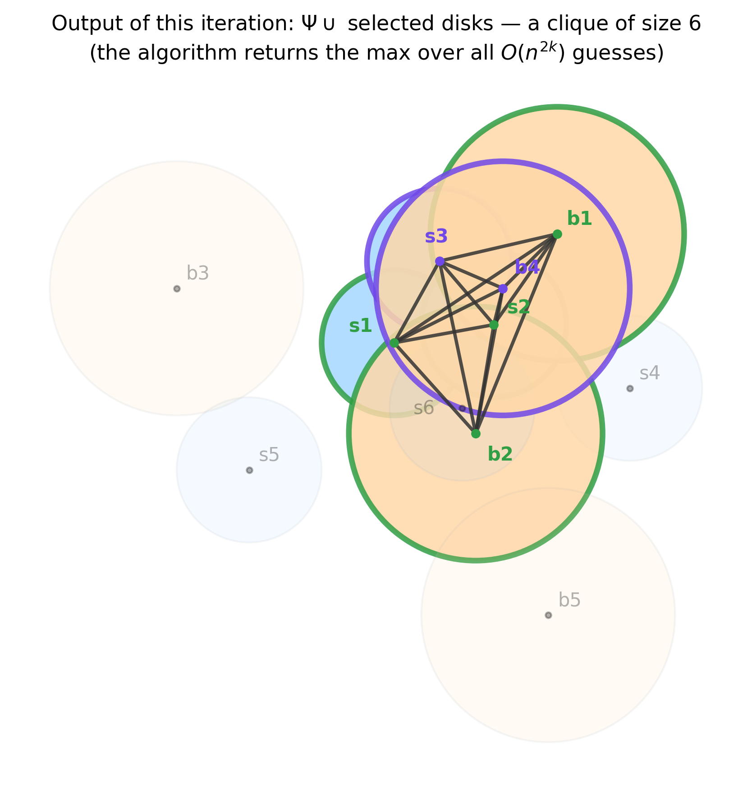
